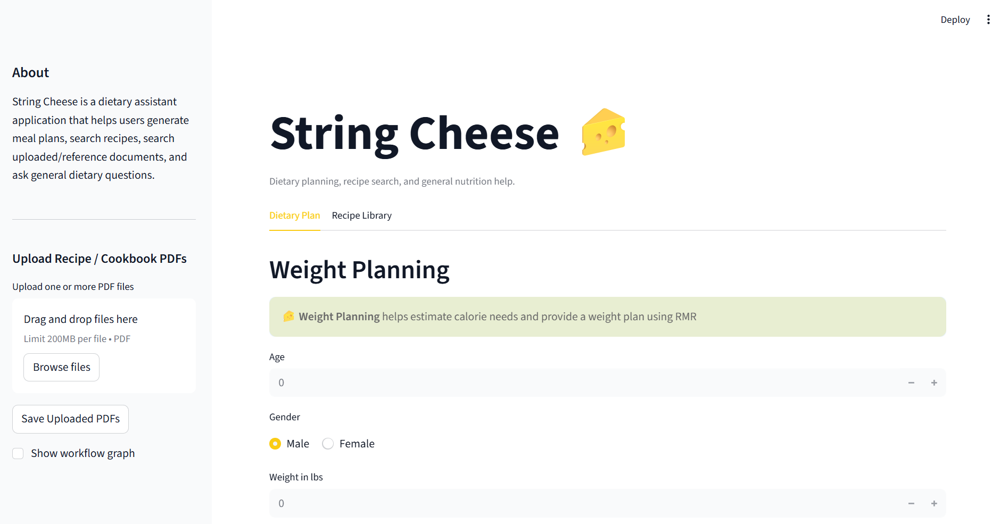
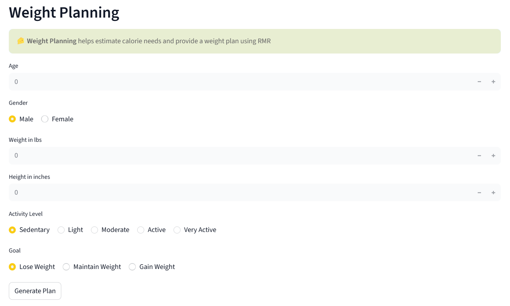
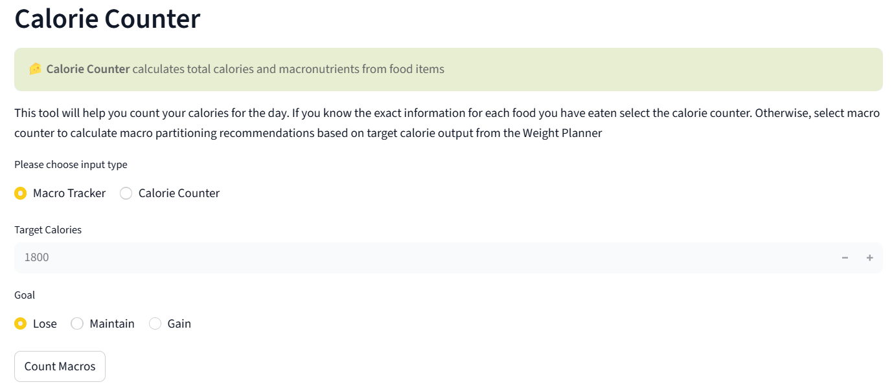
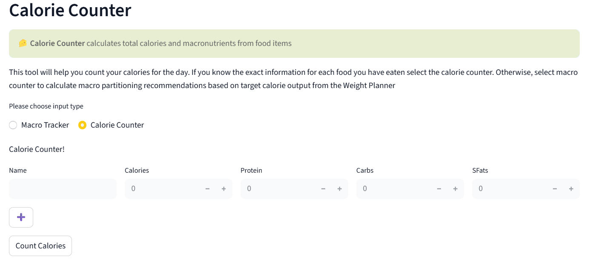
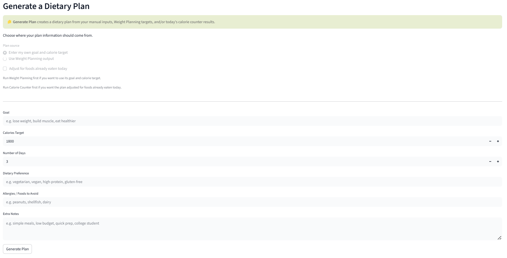
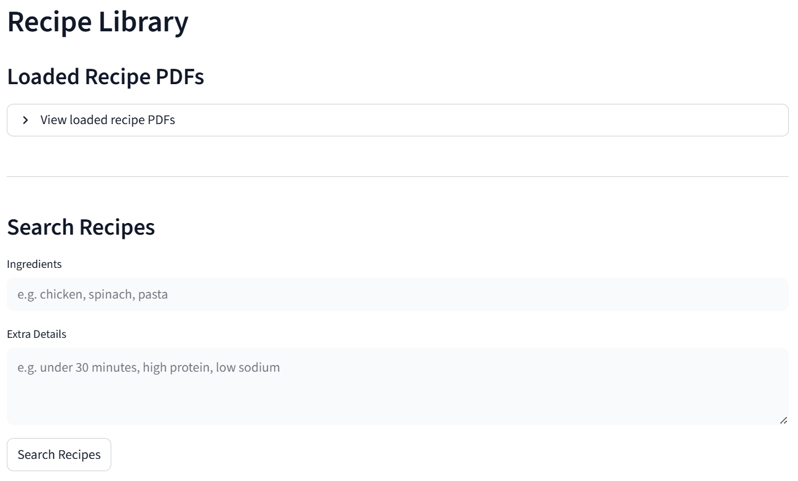
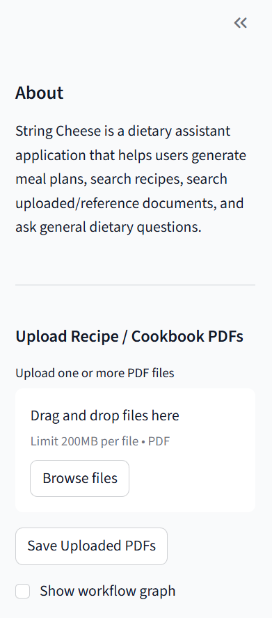

## Overview

**String Cheese** is an AI-powered dietary assistant that helps users plan meals, track nutrition, and search recipes from both built-in and user-uploaded cookbooks.

The project was created for **Creating with AI in the Loop**, a course focused on building software while actively collaborating with AI tools. String Cheese combines deterministic nutrition tools with LLM-generated planning and PDF-based recipe retrieval.

## Team

- Freddy Melges
- Gillian Donley
- Raighen Ly

## Project Goals

String Cheese functions as a “pocket dietitian” that supports users with:

- Personalized dietary plans
- Weight planning for losing, maintaining, or gaining weight
- Calorie tracking
- Macro tracking
- Recipe search from PDFs
- Custom cookbook PDF uploads

The goal of the project was to explore how AI can be used both **inside an application** and **during the development process**.

---

## Application Screenshots

::: {.panel-tabset}

## Home Page



## Weight Planner



## Calorie Counter's Macro Tracker



## Calorie Counter's Macro Tracker



## Dietary Plan Generator



## Recipe Search



## PDF Upload



:::

> Replace these placeholder image names with your actual screenshot filenames.

---

## Main Features

### Dietary Plan Generator

The dietary plan generator creates multi-day meal plans based on user inputs such as:

- Goal: lose, maintain, or gain weight
- Target calories
- Dietary preferences
- Allergies
- Custom notes

Generated plans use Gemini while following built-in safety constraints.

### Weight Planning Tool

The weight planning tool calculates:

- Resting Metabolic Rate
- Maintenance calories
- Target calorie intake

This helps users estimate a calorie goal based on their body information and dietary goal.

### Calorie Counter

The calorie counter tracks total calories and macronutrients from user input. It can support daily, weekly, or monthly tracking.

### Macro Tracker

The macro tracker breaks calorie targets into:

- Protein
- Carbohydrates
- Fats

The distribution can be adjusted based on the user’s goal.

### Recipe Library and PDF Upload

String Cheese includes preloaded recipe documents and also allows users to upload their own cookbook PDFs. Uploaded recipes are indexed and made searchable.

### Recipe Search

Recipe search allows users to search for meals using ingredients and constraints such as:

- High protein
- Quick meals
- Vegan meals
- Meals using specific ingredients

PDFs are parsed, indexed, searched, filtered, ranked, and then formatted into readable recipe results.

---

## Technical Architecture

String Cheese uses a structured workflow built with **LangGraph**.

```text
parse_input
    ↓
route_request
    ↓
tool-specific node
    ↓
format_response